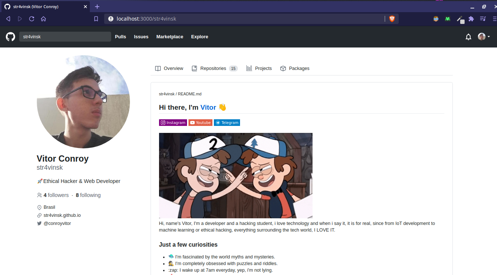
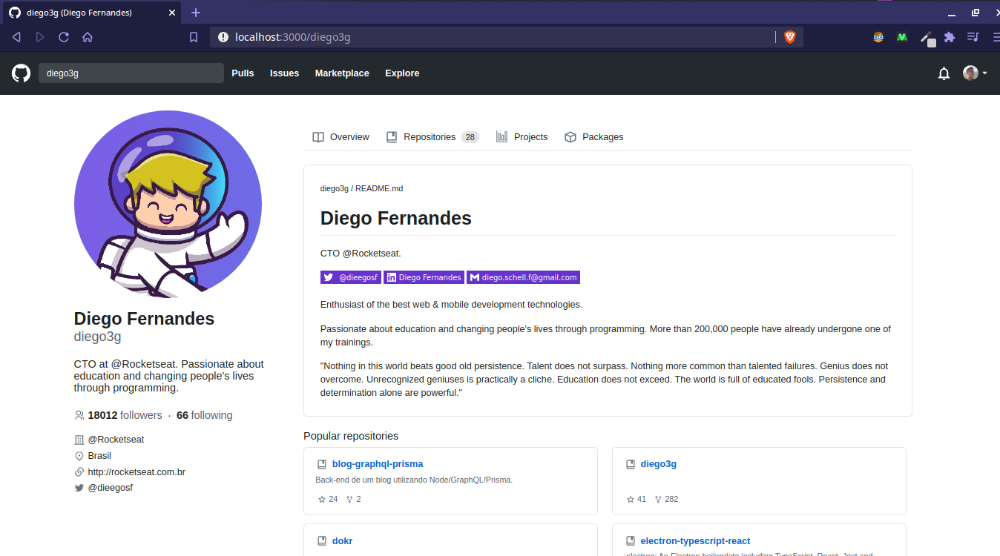

# Github UI Clone

I made it for study purposes, just to learn more about react, responsive design, rest APIs, routes and more.

---

## 📷 Screenshots




---

## 💾 Installing 

Git clone the repository

```
git clone https://github.com/str4vinsk/github-ui-clone
```

Install the dependencies

```
yarn install
```

Run it!

```
yarn start
```

---

## 💻 Technologies

- [React Js](https://developer.mozilla.org/en-US/docs/Web/API/Fetch_API)
- [JavaScript](https://www.javascript.com/)
- [HTML](https://html.spec.whatwg.org/multipage/)
- [CSS](https://devdocs.io/css/)
- [Fetch API](https://developer.mozilla.org/en-US/docs/Web/API/Fetch_API)
- [GitHub API](https://docs.github.com/en/rest)

---

## ⚛️ React Dependencies
 
 - [Styled Components](https://styled-components.com)
 - [React-Markdown-Preview](https://github.com/uiwjs/react-markdown-preview)
 - [React Icons](https://react-icons.github.io/react-icons/search)
 - [React Helmet](https://github.com/nfl/react-helmet)
 - [React Router Dom](https://reactrouter.com/web/guides/quick-start)
 - [Date FNS](https://date-fns.org/)
 - [React Calendar Heatmap](https://www.npmjs.com/package/react-calendar-heatmap)

---

## Ideas to future updates

- [ ] Create new routes with React Router
- [ ] Make dropdown menus
- [ ] Use the GITHUB API V4 (GraphQL instead of REST)

---

## 📖 Author
<table>
  <tr>
    <td  align=center>
        
        <a href="https://github.com/str4vinsk">
          <br>
            Vitor Conroy
          </br>
        </a>
        <sub>
          <a href="https://www.instagram.com/vitorconroy/" alt="instagram">
            ☕️ @vitorconroy
          </a>
        </sub>
    </td>
  </tr>
</table>
